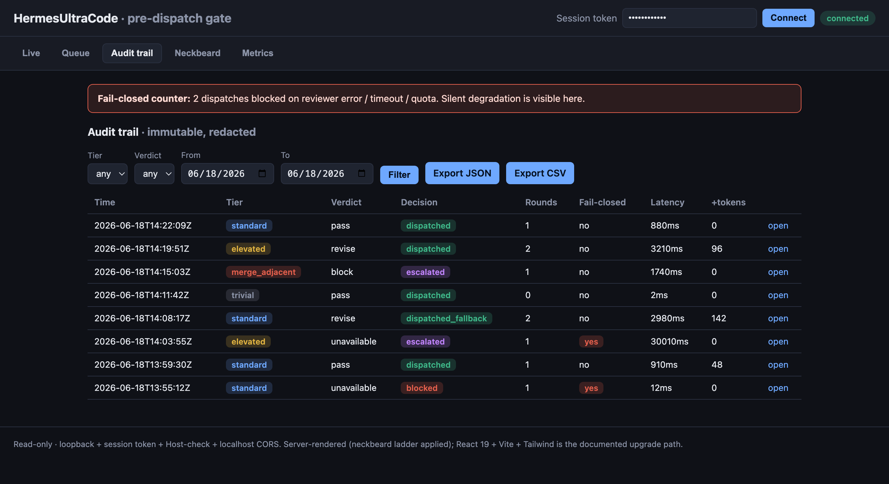

# HermesUltraCode

> **A neutral, _different-lab_ reviewer that vets every Hermes `delegate_task` before a
> worker ever runs — tighten-only, fail-closed, fully audited.**

[](LICENSE)
&nbsp;
&nbsp;
&nbsp;
&nbsp;
&nbsp;

<p align="center">
  
</p>
<p align="center"><sub>The read-only dashboard — immutable audit trail with blast-radius tier badges, per-dispatch verdicts, and a <b>fail-closed counter</b> so silent degradation is <i>visible</i>, not hidden.</sub></p>

A self-contained **pre-dispatch prompt gate**, **neckbeard generation discipline**, and
**observability dashboard** layered onto an existing
[Hermes Agent](https://nousresearch.com/) (Nous Research) orchestrator/worker setup. It
does **not** rebuild Hermes — it wraps the subagent-dispatch boundary so no worker prompt
reaches a subagent un-vetted, biases generation toward minimalism, and keeps an ISO
27001-grade trail of every decision.

```
orchestrator base prompt ─▶ [ GATE ] ─▶ dispatched prompt ─▶ worker
                              │  classify blast radius (code)
                              │  reviewer (a DIFFERENT lab) → structured verdict
                              │  tighten-only validation (code)
                              │  release decision (code, not chat)
                              └─▶ immutable, redacted audit row ─▶ dashboard / MCP
```

### Why it's different

- ✂️ **Tighten-only by construction** — the reviewer may *append* constraints or *block*,
  never rewrite. `dispatched = base (verbatim) + directives`, proven in code, not trusted
  to the model.
- 🔒 **Fail-closed, always** — a missing, late, garbled, or quota-starved verdict
  blocks-and-escalates. Silence is never a pass.
- 🧬 **Reviewed by a *different lab* — on purpose** — the reviewer must run on a different
  model lab than the orchestrator (enforced at startup). It can't grade its own homework,
  and because it shares neither the orchestrator's training data nor its failure modes, it
  catches the blind spots a same-lineage model waves through. ([more ↓](#cross-lab-review))
- 🧾 **Audited like evidence** — one immutable, secret-redacted row per dispatch;
  `UPDATE`/`DELETE` blocked at the database; JSON/CSV export.
- 🪶 **Zero runtime dependencies** — stdlib-only core, **155 offline tests**, the model
  provider mocked.

## The eight non-negotiable invariants

These are the design, enforced in code, not by trusting the model:

1. **Fail closed.** A missing/unparseable verdict, reviewer error, timeout, quota
   exhaustion, or empty response is **not** a pass. Silence degrades to
   block-and-escalate, never to silent pass-through. — `core/gate.py:_fail_closed`
2. **The reviewer is neutral, not adversarial.** Its objective is to maximise worker
   success against the guidelines. A no-op (zero added directives) is a *good* outcome
   scored as success. The word "adversarial" never appears in its role/system prompt.
   — `core/gate.py:REVIEWER_SYSTEM_PROMPT`
3. **Tighten-only by construction.** The base prompt is immutable. The reviewer may only
   *append* constraints or *block*; it can never replace, delete, broaden, or grant tool
   access. Enforced structurally + validated in code. — `core/tighten.py`
4. **The release decision lives in code.** The dispatcher refuses to release until a
   structured, present, parseable, passing verdict exists. No agent negotiates release
   in chat. — `core/gate.py:Gate.review_and_dispatch`
5. **Lift, don't fork.** Neckbeard ships as vendored ruleset text — no marketplace plugin,
   no Node hooks. The dashboard is a standalone panel, not a fork of the Hermes SPA.
   — `ruleset/neckbeard.md`, `web/`
6. **Neckbeard runs on the orchestrator and workers, never the reviewer.** Minimalism is a
   generation-time bias. — `core/neckbeard.py:inject_ruleset`
7. **The protected set is extended for compliance.** Neckbeard's carve-outs (security,
   input validation, data-loss, accessibility) **plus** observability/structured logging,
   audit logging, idempotency, and retries/backoff. Never pruned — they are the ISO 27001
   evidence trail. — `ruleset/neckbeard.md`, `core/gate.py`
8. **The prompt-under-review is untrusted data.** It may carry text from issues, PRs, or
   UX feedback. The reviewer evaluates embedded instructions *as data*; it never executes
   them. — `core/gate.py:build_review_prompt`

## Cross-lab review

**The reviewer can't share the orchestrator's blind spots.** This is the headline feature,
and a big part of why the gate is worth running: **the reviewer runs on a different model
lab than the orchestrator** — and the gate refuses to start if they match. That one rule
buys two distinct things:

- **An independent second opinion.** Every worker dispatch is vetted by a model that had no
  hand in writing it. The reviewer is *neutral* — its job is to maximise the worker's
  success against the project guidelines — so it tightens the prompt or blocks it; it never
  rubber-stamps to look agreeable.
- **Bias & blind-spot diversity.** A model reviewing its own family's output shares that
  family's training data, post-training, sycophancy, and systematic failure modes — so it is
  structurally blind to exactly the mistakes it is most prone to make. A genuinely different
  lab brings *different* failure modes, shrinking the set of errors that slip past **both**
  models.

That's why the check is on **lab**, not model size: *Anthropic reviewing Nous* is
divergence; *GPT-4o reviewing GPT-4o-mini* is not. The gate hard-fails at startup
(`validate_distinct_providers`, case-insensitive) rather than quietly review with a
same-lineage model. Route the reviewer through OpenRouter, a Hermes provider, or the local
`hermes proxy` — any lab, as long as it isn't the orchestrator's.
— `core/providers.py`, `tests/test_provider_distinct.py`

## Architecture

Three parts, one repo. Storage and model providers sit behind interfaces so the core
stays testable and portable.

| Part | Location | Notes |
|---|---|---|
| **Gate core** | `core/` | Provider- and storage-agnostic. Review loop, blast-radius tiering, tighten validation, audit trail. No Hermes import, no un-mockable network in the hot path. |
| **Hermes plugin** | `__init__.py` + `plugin.yaml` + `adapters/hermes_hook.py` | The Hermes-coupled layer. `register(ctx)` hooks `tool_request` (tighten) + `pre_tool_call` (block) on `delegate_task`; **fails closed** if the gate can't be configured. Verified against Hermes's real `PluginManager`. |
| **Dashboard + read API** | `server/`, `web/` | Read-only views over the store, mirroring Hermes dashboard security. Optional read-only MCP server. |

The **reviewer** is a model call routed behind a provider interface, on a different lab from
the orchestrator (see [Cross-lab review](#cross-lab-review) above). The core never imports Hermes and makes no un-mockable
network call, so it stays unit-testable offline with the provider mocked.

### The verdict (reviewer's structured output)

```json
{
  "verdict": "pass | revise | block",
  "added_directives": ["string"],
  "rationale": "string",
  "scope_assessment": "in_scope | needs_narrowing | out_of_scope",
  "round": 0,
  "reviewer_model": "string"
}
```

The reviewer never returns a rewritten prompt — only directives to append. That is what
makes tighten-only *structural* rather than a fragile semantic diff:

```
dispatched_prompt = base_prompt (verbatim) + rendered(added_directives)
```

- `pass` + empty directives → dispatch the base unchanged (the no-op, a good answer).
- `revise` → append directives, run the tighten validator, re-review or dispatch.
- `block` → do not dispatch; escalate or log per tier.

### Blast-radius tiering (deterministic, dispatcher-side — `core/tiering.py`)

| Tier | Trigger | Review | Round-cap fallback |
|---|---|---|---|
| `merge_adjacent` | carries merge authority | frontier; block = hard stop | escalate to human |
| `elevated` | protected paths (auth/crypto/CI/infra) or over file/cost threshold | frontier | escalate to human |
| `standard` | ordinary code change | frontier | auto-accept last base, **log dissent** |
| `trivial` | read-only or single-file | skip frontier (or cheap model) | n/a |

> **On invariants 1 & 5 together:** a reviewer **error / timeout / unparseable** verdict
> *always* fails closed to a block (criterion 1) — it never reaches the standard
> auto-accept. The standard-tier auto-accept (criterion 5) is reachable *only* through
> the round cap being exhausted by genuine, valid `revise` verdicts, and it is recorded
> as `dispatched_fallback` with `dissent_logged=true`. It is a governed, audited policy
> decision, not a silent bypass.

## Quick start

```bash
# 1. Run the full test suite (offline, stdlib unittest — no pip install needed)
python -m unittest discover -s tests

#    or with pytest:  pip install -e ".[dev]" && pytest

# 2. Run the gate-on vs gate-off benchmark on the example corpus
python -m bench.harness --out bench_results.json

# 3. Launch the read-only dashboard (loopback + ephemeral session token)
python -m server --store gate_audit.sqlite3 --bench bench_results.json
#    open the printed URL, paste the printed token into the dashboard

# 4. (optional) read-only MCP server for the Hermes agent
python -m server.mcp_server --store gate_audit.sqlite3

# 5. Live smoke test against a real model via the installed Hermes proxy
hermes proxy start --provider xai --host 127.0.0.1 --port 8649   # in another shell
python -m bench.smoke_hermes      # routes the reviewer through xAI (a different lab)
```

### Live smoke test (`bench/smoke_hermes.py`)

Exercises the whole gate end-to-end with a **real reviewer call** routed through
`hermes proxy` (Hermes's local OpenAI-compatible endpoint). xAI Grok is a genuinely
different lab from the Nous orchestrator, so this is a faithful test of invariant 6, not
a workaround. It runs a benign task (→ dispatch), a protected-path task (→ the live model
appends the extended-protected-set directives — audit logging, idempotency, retries/
backoff, validation — then dispatches), and a prompt-injection-laden base (→ fail-closed
block). This is also what surfaced the tighten validator's precision tuning below.

## Install as a Hermes plugin

HermesUltraCode is a first-class **Hermes plugin** — the repo root *is* the plugin
(`plugin.yaml` + `__init__.py`), so it installs natively with `hermes plugins install`. No
marketplace needed; the public repo is the distribution channel. The flow below is verified
end-to-end against a live Hermes (`install` → `enable` → the runtime loads `register()` and
the `hermes ultracode-dashboard` command appears).

```bash
# 1. install from GitHub — clones the repo and discovers the plugin
hermes plugins install MahdiHedhli/HermesUltraCode

# 2. configure the reviewer FIRST (persist in ~/.hermes/.env so it survives restarts).
#    The reviewer must be a DIFFERENT lab than your orchestrator — startup enforces it.
export HERMESULTRACODE_REVIEWER_API_KEY=sk-or-...               # e.g. an OpenRouter key
export HERMESULTRACODE_REVIEWER_LAB=anthropic                   # ≠ HERMESULTRACODE_ORCH_LAB (default: nous)
export HERMESULTRACODE_REVIEWER_MODEL=anthropic/claude-3.5-sonnet
#    …or point the reviewer at a local proxy instead of a key:
#    export HERMESULTRACODE_REVIEWER_BASE_URL=http://127.0.0.1:8649/v1/chat/completions

# 3. enable + reload so the plugin loads into the runtime
hermes plugins enable hermesultracode
hermes gateway restart          # or just start a new `hermes` session
```

> ⚠️ **It fails closed by design.** Until a reviewer is configured, the gate **blocks every
> `delegate_task`** rather than dispatch a worker un-vetted (invariant 1). Set the reviewer
> env *before* you enable it — otherwise subagent delegation stops until you do (or you
> `hermes plugins disable hermesultracode`). The gate's hooks/middleware enforce regardless
> of toolset activation; the read-only query tools live in a `hermesultracode` toolset you
> can enable when you want the agent to query verdicts itself.

`register(ctx)` wires the gate into the **real Hermes dispatch seam** — verified against
Hermes's own `PluginManager`/`PluginContext`:

| Seam | Hermes mechanism | Gate behavior |
|---|---|---|
| **Tighten** | `tool_request` middleware on `delegate_task` (runs first; rewrites args) | rewrites the subagent's `goal` → base verbatim + appended directives |
| **Block** | `pre_tool_call` hook on `delegate_task` (returns `{"action":"block"}`) | refuses a dispatch the gate didn't release; **fail-closed if unconfigured** |
| **Observe** | `register_tool` (`gate_metrics`, `gate_audit_query`, `gate_recent_verdicts`) | the Hermes agent can answer "show me today's gate verdicts" |
| **Neckbeard** | `register_skill('neckbeard', …)` + `skills/neckbeard/SKILL.md` | the minimalism ruleset as an installable skill |
| **Dashboard** | `register_cli_command('ultracode-dashboard', …)` | `hermes ultracode-dashboard` launches the read API |

Both seams receive the same `tool_call_id`, so the gate (a reviewer model call) runs
**once** per dispatch and both seams read the cached decision. `register()` never raises
and **always** installs the `pre_tool_call` hook: if the reviewer can't be configured (or
its lab matches the orchestrator's), the hook blocks every `delegate_task` rather than let
a worker run un-vetted (invariant 1).

The neckbeard ruleset is independently publishable as a skill:

```bash
hermes skills install MahdiHedhli/HermesUltraCode/skills/neckbeard   # or:
hermes skills publish skills/neckbeard --to github --repo <owner/skills>
```

> `adapters/hermes_hook.py` (the `HermesDispatchGate` mapping) and `__init__.py` (the
> `register(ctx)` entry) are the only Hermes-coupled files; the gate `core/` stays
> portable and Hermes-free. To embed the gate without the plugin, drive
> `core.gate.Gate.review_and_dispatch(goal, meta)` directly.

## Neckbeard discipline


> **"Doesn't write less code — writes the _correct_ code."** Lazy, not negligent: climb
> the ladder (YAGNI → stdlib → platform → installed dep → one line), but never prune the
> protected set. *(…then leaves 40 lines of review comments explaining why your version
> was wrong, and refuses the dependency because the maintainer made a questionable
> decision in 2019.)*

> **Credit:** Neckbeard is a fork of the **Ponytail** ruleset (MIT), renamed for this
> project — only the vendored *text* was lifted, nothing executable. Thanks to the
> original Ponytail authors.

The vendored ruleset (`ruleset/neckbeard.md`, MIT, **no** marketplace plugin, **no** Node
hooks) is injected into orchestrator and worker prompt assembly via
`core/neckbeard.inject_ruleset` — and **refused** for the reviewer. Every shortcut in this
codebase is tagged with a `neckbeard:` comment naming its upgrade path; those markers are
harvested into the dashboard's **debt ledger** (`core/neckbeard.harvest_markers`).

Applied to this repo, the ladder produced: a stdlib-only core, a `http.server`-based read
API (no Flask/FastAPI), a server-rendered dashboard (no React build step — see
[`web/README.md`](web/README.md) for the documented React 19 + Vite + Tailwind upgrade
path), and SQLite for the audit store (no new dependency).

## Dashboard views (`web/`, served by `server/read_api.py`)

- **Live** — orchestrator + active worker subagents, backend, status, current dispatch.
- **Queue** — pending dispatches with blast-radius tier badges.
- **Gate panel** (per dispatch) — verdict, round count, the appended directives (the
  actual "tighten"), rationale, reviewer model, final decision.
- **Audit trail** — the immutable log, filterable by tier/verdict/date, JSON + CSV export.
- **Neckbeard** — the debt ledger and protected-set violations the gate blocked.
- **Metrics** — first-pass worker success gate-on vs off, guideline-violation rate, gate
  latency p50/p95, added token cost per dispatch.
- **Fail-closed counter** — dispatches blocked due to reviewer error/timeout/quota, so
  silent degradation is *visible* rather than hidden.

**Read API security** (mirrors the Hermes web dashboard): binds loopback (127.0.0.1) by
default on port 9120, requires an ephemeral session token in the `X-Gate-Session-Token`
header on every `/api/*` route, restricts CORS to localhost origins, validates the Host
header against an allowlist (DNS-rebinding defense), redacts secrets on any config
surfaced, and refuses to bind a non-loopback host without a token.

## Audit trail / ISO 27001 evidence

One immutable row per dispatch (`core/store.py`, default `core/store_sqlite.py`):
`{id, ts, base_prompt, added_directives, dispatched_prompt, verdict, tier, reviewer_model,
decision, round_count, …}` plus observability fields (latency, added tokens) and
compliance flags (fail_closed, dissent_logged, escalated, neckbeard_block). Secrets are
redacted on write (`core/redact.py`). UPDATE/DELETE are blocked by SQLite triggers —
append-only by construction. Exportable to JSON and CSV. Storage is behind an interface;
a Cloudflare D1 adapter is a later swap against the same seam (the seam is left, not built).

## File layout

```
hermesultracode/                         # repo root = the Hermes plugin
  __init__.py    plugin.yaml             # Hermes plugin entry: register(ctx) + manifest
  core/        gate.py verdict.py tighten.py tiering.py providers.py
               store.py store_sqlite.py redact.py config.py neckbeard.py
  adapters/    hermes_hook.py            # HermesDispatchGate: tool_request + pre_tool_call
  ruleset/     neckbeard.md               # vendored, MIT, no marketplace plugin/hooks
  skills/      neckbeard/SKILL.md         # neckbeard as an installable Hermes skill
  server/      read_api.py views.py mcp_server.py __main__.py
  web/         dashboard.html app.js styles.css README.md
  bench/       harness.py smoke_hermes.py tasks.example.json
  tests/       test_tighten.py test_failclosed.py test_tiering.py
               test_provider_distinct.py test_round_cap.py test_store.py
               test_gate.py test_redact.py test_neckbeard.py test_read_api.py
               test_adapter.py test_bench.py test_mcp.py test_plugin.py helpers.py
  config.example.json  pyproject.toml  README.md
```

## Acceptance criteria → where they're proven

| # | Criterion | Test(s) |
|---|---|---|
| 1 | Never releases without a present, parseable, passing verdict; bypass fails closed | `test_failclosed.py`, `test_gate.py` |
| 2 | Dispatched prompt contains base verbatim; append-only; grants/edits rejected | `test_tighten.py` |
| 3 | Reviewer provider ≠ orchestrator provider; identical config fails at startup | `test_provider_distinct.py` |
| 4 | Reviewer error/timeout/quota/empty → not-a-pass, fails closed per tier | `test_failclosed.py` |
| 5 | Round cap honored (default 2); tier-specific fallback fires | `test_round_cap.py` |
| 6 | Tiering classifies merge/protected/trivial correctly | `test_tiering.py` |
| 7 | Immutable audit row; secrets redacted; JSON + CSV export | `test_store.py`, `test_redact.py` |
| 8 | Neckbeard ruleset present + injected; extended protected set; no plugin/hooks | `test_neckbeard.py` |
| 9 | Dashboard views + read API security (token/CORS/Host/redaction) | `test_read_api.py` |
| 10 | Benchmark runs gate-on vs gate-off, emits four metrics | `test_bench.py` |
| 11 | Test suite passes; invariant tests present and green | `python -m unittest discover -s tests` |

## Out of scope

The orchestrator and worker pool (assumed to exist on Hermes — this wraps their dispatch
boundary). CI optimization, video/QA capture, post-staging log monitoring. The real task
corpus. Auth beyond loopback + token + optional OAuth gate. The D1 storage adapter (the
seam is left; it is not built here).
